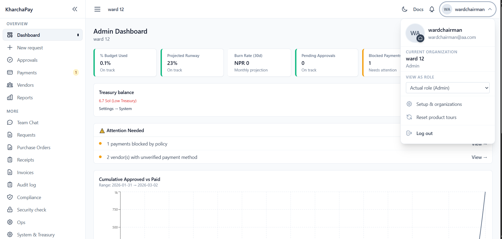
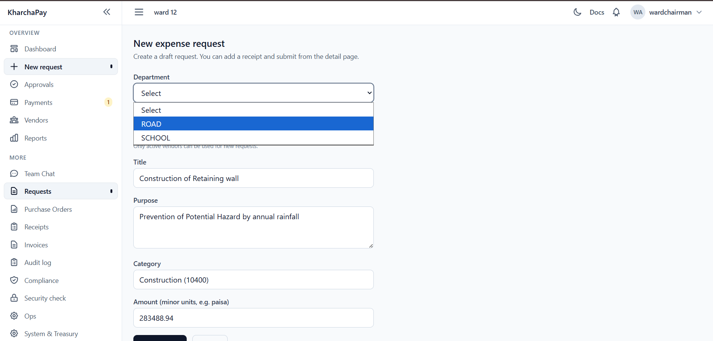
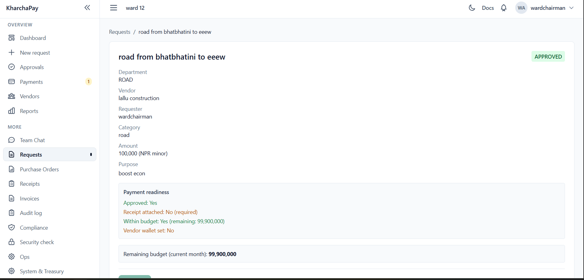
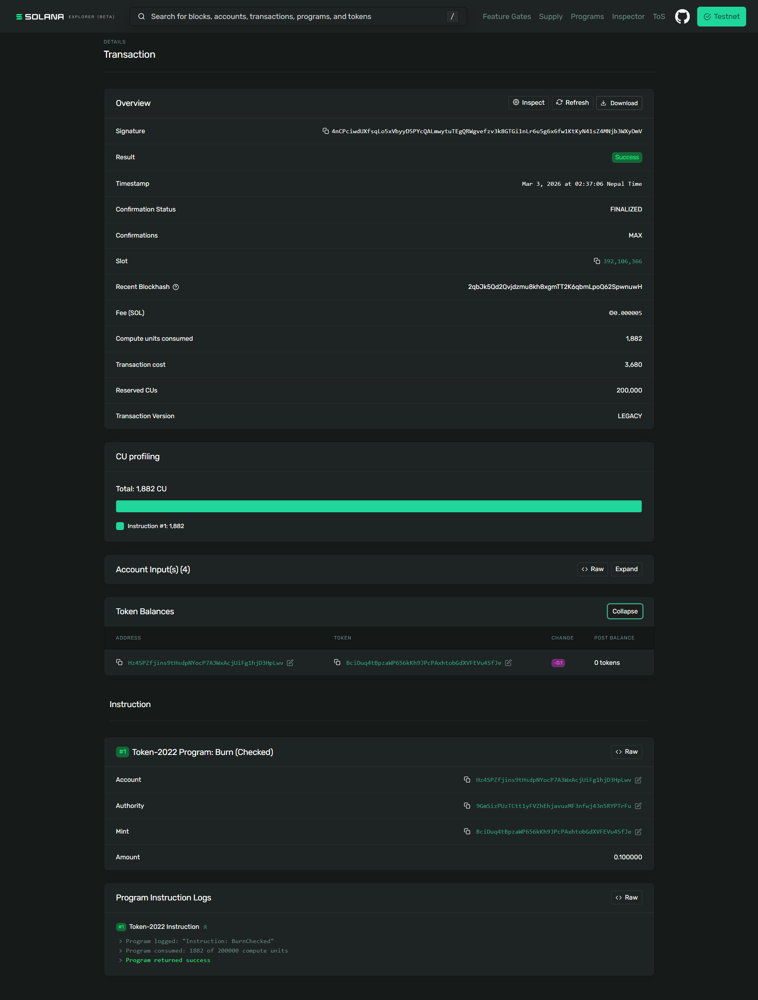
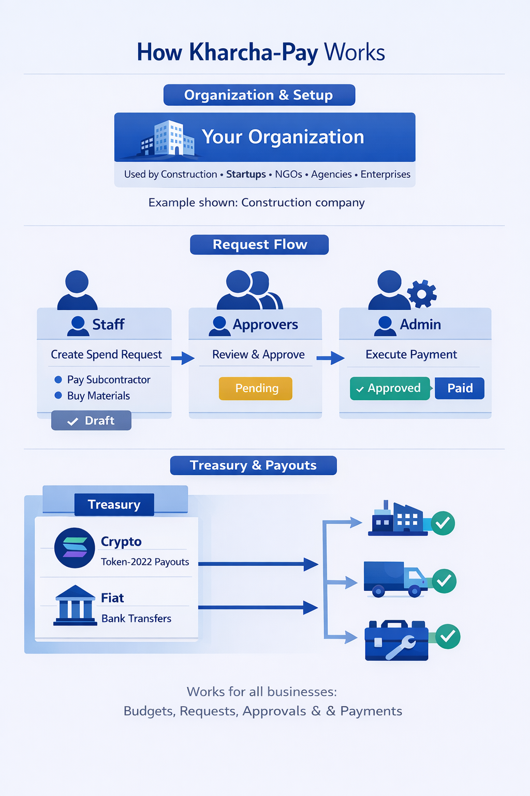
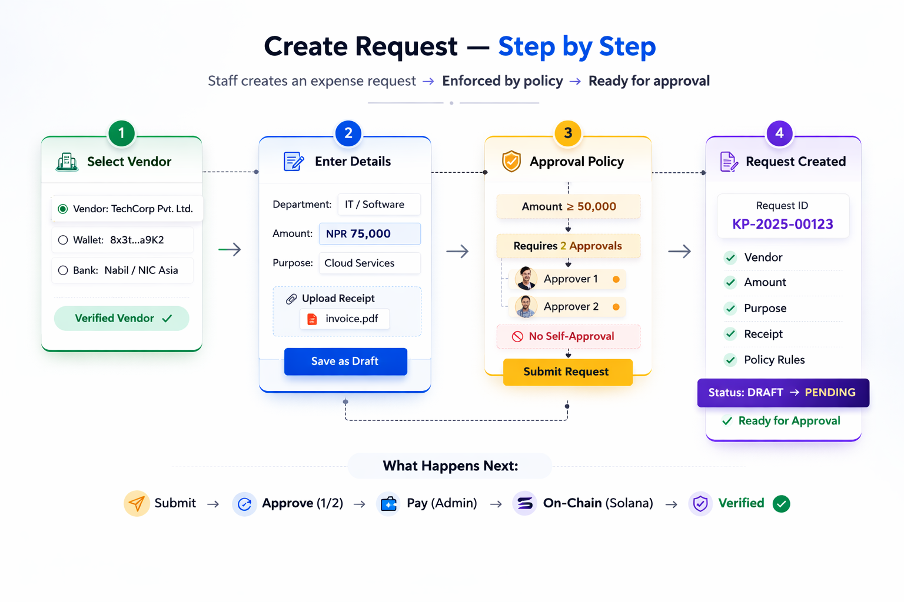
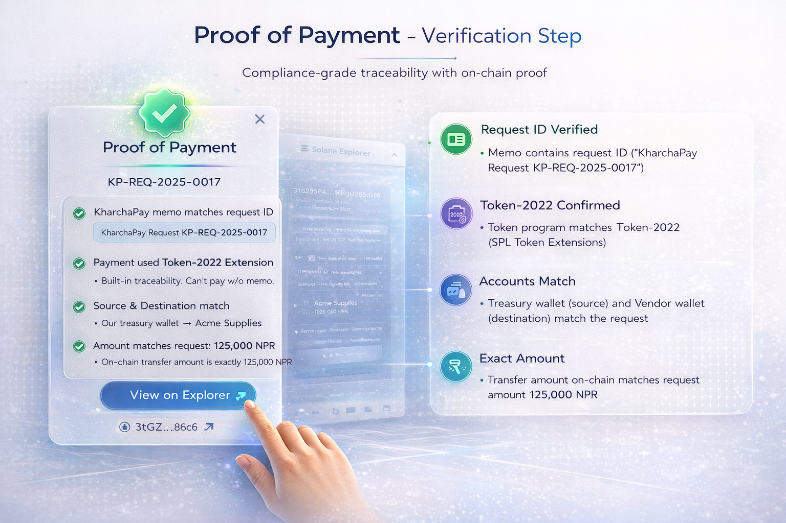

<h1 align="center">🇳🇵 KharchaPay</h1>
<h3 align="center">Verifiable Institutional Spending on Solana</h3>
<p align="center">
  <em>"Turning approvals into cryptographic proof."</em>
</p>

<p align="center">
  <a href="#-why-this-matters">Why This Matters</a> •
  <a href="#-problem-statement">Problem</a> •
  <a href="#-solution">Solution</a> •
  <a href="#-how-it-works">How It Works</a> •
  <a href="#-tech-stack">Tech Stack</a> •
  <a href="#-run-locally">Run Locally</a>
</p>

---

## Institutions don't just need payments.  
## They need **proof**.

KharchaPay is a **production-grade institutional spend management system** built on Solana that converts internal approval workflows into cryptographically verifiable on-chain transactions using Token-2022 and Required Memo enforcement.

Every approved expense becomes:

```
Policy enforced → Approved → Paid → On-chain → Independently verifiable
```

**No backend trust required.**  
**No spreadsheet ambiguity.**  
**No reconciliation guesswork.**

---

## 🚀 Why This Matters

Governments, NGOs, startups, and civic organizations in Nepal still rely on:

- Manual approvals
- Bank screenshots
- Excel-based audit trails
- Opaque financial processes

**KharchaPay replaces that with:**

> On-chain, policy-driven, auditable institutional payments.

This is not a wallet app.  
This is not a simple token transfer demo.  
**This is institutional infrastructure on Solana.**

---

## 🧠 Problem Statement

Institutions struggle with:

| Challenge | Impact |
|-----------|--------|
| Lack of transparent spend verification | Auditors can't trust the numbers |
| Manual approval chains | Delays, errors, no audit trail |
| Weak separation of duties | Fraud risk, compliance gaps |
| Audit friction | Weeks of manual reconciliation |
| No verifiable link between approval and payment | Governance is opaque |

**Even in crypto:**

- Payments are transparent  
- **But governance is not.**

There is no strong link between internal approval logic and the actual on-chain transaction—until KharchaPay.

---

## 💡 Our Solution

KharchaPay binds:

```
Approval Policy → Expense Request → Token-2022 Transfer → Required Memo → On-chain Verification
```

### Token-2022 + Required Memo Transfer

We use the **Token-2022** program with the **Required Memo Transfer** extension:

- **Deterministic memo format:** `KharchaPay Request {requestId}`
- Memo is **enforced at the token account level** → transfer cannot happen without the request ID
- Memo is embedded directly in the transaction
- Anyone can verify it on Solana Explorer

No backend manipulation possible. The cryptographic binding is enforced by the protocol.

---

## 🖼️ Product Screenshots

| Dashboard | Approval Flow |
|:---------:|:-------------:|
|  |  |

| Proof Modal | Solana Explorer Verification |
|:-----------:|:----------------------------:|
|  | <sup>↓ Expand below</sup> |

<details>
<summary><b>Solana Explorer — on-chain verification</b></summary>



</details>

---

## ⚙️ How It Works

### Flow Overview



### 1️⃣ Create Request

Staff creates:

- **Vendor**
- **Department**
- **Amount**
- **Purpose**



### 2️⃣ Approval Engine

Configurable approval tiers:

| Amount | Approvals Required |
|--------|--------------------|
| < 5,000 NPR | 1 approval |
| ≥ 5,000 NPR | 2 approvals |

**Rules enforced:**

- Requester **cannot** approve their own request
- One decision per actor
- Separation of Duties enforced

### 3️⃣ Pay (ADMIN Only)

Triggers:

- Token-2022 transfer
- Memo instruction placed immediately before transfer
- Memo = `KharchaPay Request {requestId}`

### 4️⃣ On-Chain Reconciliation

Server verifies:

- [ ] Transaction exists
- [ ] Memo matches request ID
- [ ] Token program = Token-2022
- [ ] Source = treasury
- [ ] Destination = vendor
- [ ] Amount matches request

**Status:** `VERIFIED` | `WARNING` | `FAILED` | `PENDING`

### 5️⃣ Proof Modal



User can:

- Click **"View on Explorer"**
- See memo instruction
- See token mint
- See source & destination
- **Verify independently** — no trust in backend required

---

## 🏗️ Architecture

Monorepo structure (production-grade):

| Component | Technology |
|-----------|------------|
| Frontend | Next.js 14 (App Router) |
| Database | PostgreSQL + Prisma (58 models, 37 migrations) |
| Blockchain | Token-2022 integration |
| Auth | Custom JWT + Argon2id |
| Security | CSRF protection, step-up reauthentication |
| Accounting | Double-entry treasury ledger |
| Fiat | Off-ramping via Circle |
| Events | Event-driven treasury (24 event types) |
| API | 184 API routes |
| Tests | 80+ tests (Vitest) |

**This is not a prototype with 3 endpoints.**  
**It is a full institutional system.**

See [docs/ARCHITECTURE.md](docs/ARCHITECTURE.md) for full technical documentation.

---

## 🔗 Solana Integration

| Aspect | Details |
|--------|---------|
| **Program** | Token-2022 |
| **Extension** | Required Memo Transfer |

### Why Required Memo?

Because it enforces:

> **No memo → No transfer.**

This cryptographically binds **approval logic → on-chain transaction**.  
No backend manipulation possible.

---

## 🏦 Treasury System

Beyond basic spend management, KharchaPay includes:

- Double-entry ledger
- Spend policies
- Circuit breakers
- Payout approval thresholds
- Fiat off-ramping via Circle
- Balance snapshots
- Reconciliation drift detection
- SSE-based real-time treasury events

This transforms it from *"expense tracker"* into a **crypto-native treasury operating system**.

---

## 🛠️ Tech Stack

| Layer | Tech |
|-------|------|
| Frontend | Next.js 14 |
| Backend | Route Handlers |
| DB | PostgreSQL |
| ORM | Prisma |
| Auth | JWT (jose) + Argon2id |
| Blockchain | Solana |
| Token Standard | Token-2022 |
| Fiat | Circle |
| Accounting | QuickBooks |
| Testing | Vitest |

---

## 🎯 Evaluation Criteria Mapping

| Criteria | Coverage |
|----------|----------|
| **Problem Statement** | Bridges institutional governance and on-chain payments |
| **Potential Impact** | NGOs, civic funds, grant disbursement, Janamat-based treasury voting |
| **Business Case** | SaaS: per-org pricing, compliance add-ons, accounting integrations |
| **UX** | Guided demo flow, role-based dashboards, interactive tours, proof modal |
| **Technical Depth** | Token-2022, on-chain reconciliation, double-entry ledger, RBAC |
| **Demo Video** | 3-min flow: create → approve → pay → Explorer memo → proof modal |

---

## 🧪 Run Locally

```bash
npm install
npm run db:generate
npm run db:migrate:deploy
npm run dev
```

**Environment variables** (create `apps/web/.env`):

| Variable | Required | Description |
|----------|----------|-------------|
| `DATABASE_URL` | Yes | PostgreSQL connection string |
| `JWT_SECRET` | Yes | Min 32 chars, for signing JWTs |
| `SOLANA_RPC_URL` | For pay/verify | e.g. `https://api.devnet.solana.com` |
| `TREASURY_KEYPAIR_JSON` | For pay | 64-byte array as JSON `[1,2,...,64]` |
| `SOLANA_CLUSTER` | For pay | `devnet` or `mainnet-beta` |

**Visit:** [http://localhost:3000](http://localhost:3000)

---

## 🌍 Vision

KharchaPay can evolve into:


- Public governance transparency layer
- DAO-grade institutional finance stack

**This is Nepal building real institutional crypto infra.**

---

## 📚 Documentation

| Doc | Description |
|-----|-------------|
| [docs/ARCHITECTURE.md](docs/ARCHITECTURE.md) | Project structure, tech stack, API, Solana flow |
| [docs/DATA-MODELS.md](docs/DATA-MODELS.md) | Prisma models quick reference |
| [docs/ops/env.md](docs/ops/env.md) | Environment variables |
| [docs/release-notes.md](docs/release-notes.md) | Shipped modules, limitations |

---

## Built solo by dhakalsushant00
---

## License

MIT
